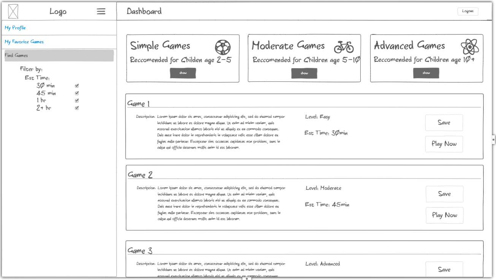

# The best startup yet!!??

### Pitch

 Imagine you are comming home from work after a day at work. You are tired but have been looking forward to spending sacred time with your kids. You have a few things to do around the house before you are free to spend time with them. You finish and finally have an hour to spend with them. You realize that in all your efforts to make time to spend with your family you forgot to plan anything. That is where my product comes it. It will allow parents and kids to hop on and find a curated list of fun family time ideas. No planning necessary. You put in the amount of time that you have and you get a list fun ideas suited to your needs. All you need to do is subscribe and create a profile for your family. 

### Key Features
* Secure login
* A list of your favorite games
* An evolving list of games to play
* Simple easy to understand instructions
* Ability to publish your own game ideas

http://3.22.125.215/

#### A few notes on things that I have learned
* Be careful when creating a repository or I will end up with a phantom branch
* Use git bash instead of bash on cmd prompt
* chmod 400 <key> is the correct permission for the key
* seems like there is a lot of code duplication in html, is there a solution to this?
* careful with HTML bugs, if the CSS isnt showing up it could be because of an HTML typo
* a google search with bootstrap ___ styles usually finds good examples of bootstrap tools
* develop HTML and CSS in parallel when possible
* build a js file for each page so it isnt as complex and can be tested incrementally
* dont overcomplicate things, js isnt meant for super complex things and I dont have the time anyways
* js has multiple ways to do things
* log is a great tool to fix silent bugs

#### server to do list
* games are currently on local storage, move them to server so they are more persistant (will be in database later)
* add other basic js things like simon has
* add a way to add games - simple webpage
* objects can be added straight into mongodb
  
##### use mongo connection string from node 2.2.12 for it to work

##### other notes
* Domain names - An A record is a straight mapping from a domain name to IP address. A CNAME record maps one domain name to another domain name. This acts as a domain name alias. You would use a CNAME to do things like map byu.com to the same IP address as byu.edu so that either one could be used.
* Modern HTML contains over 100 different elements. Here is a short list of HTML elements that you will commonly see.

| element   | meaning                                                                |
| --------- | ---------------------------------------------------------------------- |
| `html`    | The page container                                                     |
| `head`    | Header information                                                     |
| `title`   | Title of the page                                                      |
| `meta`    | Metadata for the page such as character set or viewport settings       |
| `script`  | JavaScript reference. Either a external reference, or inline           |
| `include` | External content reference                                             |
| `body`    | The entire content body of the page                                    |
| `header`  | Header of the main content                                             |
| `footer`  | Footer of the main content                                             |
| `nav`     | Navigational inputs                                                    |
| `main`    | Main content of the page                                               |
| `section` | A section of the main content                                          |
| `aside`   | Aside content from the main content                                    |
| `div`     | A block division of content                                            |
| `span`    | An inline span of content                                              |
| `h<1-9>`  | Text heading. From h1, the highest level, down to h9, the lowest level |
| `p`       | A paragraph of text                                                    |
| `b`       | Bring attention                                                        |
| `table`   | Table                                                                  |
| `tr`      | Table row                                                              |
| `th`      | Table header                                                           |
| `td`      | Table data                                                             |
| `ol,ul`   | Ordered or unordered list                                              |
| `li`      | List item                                                              |
| `a`       | Anchor the text to a hyperlink                                         |
| `img`     | Graphical image reference                                              |
| `dialog`  | Interactive component such as a confirmation                           |
| `form`    | A collection of user input                                             |
| `input`   | User input field                                                       |
| `audio`   | Audio content                                                          |
| `video`   | Video content                                                          |
| `svg`     | Scalable vector graphic content                                        |
| `iframe`  | Inline frame of another HTML page                                      |

  Character	Entity
&	&amp;
<	&lt;
>	&gt;
"	&quot;
'	&apos;
😀	&#128512;
  
CSS inside to out
  * content, padding, border, margin
  
objects:
* { key: value }
* can specify functions log: log() {...}
* constructor is a function that returns a object
  function Person(name) {
  return {
    name: name,
    log: function () {
      console.log('My name is ' + this.name);
    },
  };
}

const p = new Person('Eich');
p.log();
// OUTPUT: My name is Eich
  
class
* explicit constructor
* no need for function label 
* # makes it private
* class Employee extends Person
class Person {
  constructor(name) {
    this.name = name;
  }

  log() {
    console.log('My name is ' + this.name);
  }
}

const p = new Person('Eich');
p.log();
  
Rest:
But JavaScript provides the rest syntax to make this easier. Think of it as a parameter that contains the rest of the parameters. To turn the last parameter of any function into a rest parameter you prefix it with three periods. You can then you can call it with any number of parameters and they are all automatically combined into an array.

function hasNumber(test, ...numbers) {
  return numbers.some((i) => i === test);
}

hasNumber(2, 1, 2, 3);
// RETURNS: true
  
Spread:
  Spread does the opposite of rest. It take an object that is iterable (e.g. array or string) and expands it into a function's parameters. Consider the following.

function person(firstName, lastName) {
  return { first: firstName, last: lastName };
}

const p = person(...['Ryan', 'Dahl']);
console.log(p);
// OUTPUT: {first: 'Ryan', last: 'Dahl'}
  
Destructuring:
  const [b, c, ...others] = a;

console.log(b, c, others);
// OUTPUT: 1, 2, [4,5]
  
  const { a, b = 22 } = {};
const [c = 44] = [];

console.log(a, b, c);
  
await - block until promise is fullfilled
async - must be defined at top level, makes it work with await
  
script things:
  * chmod +x deploy.sh make a script executable
  * ls -la deploy.sh list all elements, even hidden ones in log format
  
httpOnly tells the browser to not allow JavaScript running on the browser to read the cookie.
secure requires HTTPS to be used when sending the cookie back to the server.
sameSite will only return the cookie to the domain that generated it.
